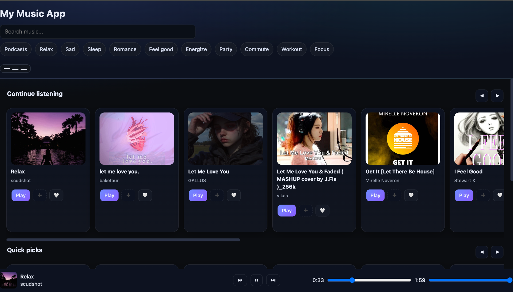

# Milad Music (Web Player)

Search, play, like, queue, and build playlists in a fast, hackable **vanilla‑JS** web app. Your library is stored locally with **IndexedDB** for **offline** use; audio streams from public APIs (Audius by default, Jamendo optional).

[**Live Demo** → miladmodasir.github.io/Musicapp](https://miladmodasir.github.io/Musicapp/)




---

## ✨ Features

**Home**

* Continue Listening (recents)
* Quick Picks (Audius trending)
* Smooth, touch‑friendly horizontal carousels

**Search**

* Sources: **Audius** (no key) + **Jamendo** (optional API key)
* Bigger cover art with graceful fallbacks

**Player**

* Footer mini‑player: seek, volume, prev/next, play/pause
* Full **Now Playing** page with big artwork, title/artist, and **Up Next**
* State persists on refresh (track, position, volume)
* YouTube‑style **keyboard shortcuts** (see below)

**Library**

* Like / Unlike tracks (❤️)
* Shuffle / Play all

**Playlists**

* Create, rename, delete
* Add from Home / Search / Library via ➕ picker
* Play / Shuffle playlist

**Storage & Offline**

* Likes, recents, playlists saved in **IndexedDB** (via **Dexie**)
* Works offline for library & playlists (streaming requires internet)

**UI**

* Modern dark theme, chip filters, drawer nav (hamburger → slide‑in)

---

## 🧭 Table of Contents

* [Quick Start](#-quick-start)
* [Keyboard Shortcuts](#-keyboard-shortcuts)
* [APIs & Keys](#-apis--keys)
* [Project Structure](#-project-structure)
* [Deploy (GitHub Pages)](#-deploy-github-pages)
* [Troubleshooting](#-troubleshooting)
* [Roadmap](#-roadmap)
* [Contributing](#-contributing)
* [License](#-license)

---

## 🚀 Quick Start

**1) Clone**

```bash
git clone https://github.com/MiladModasir/Musicapp.git
cd Musicapp
```

**2) Run locally (any static server)**

```bash
# Option A
npx serve .
# Option B (Python)
python3 -m http.server 5173
# then open http://localhost:5173
```

**3) (Optional) Jamendo key** – see [APIs & Keys](#-apis--keys).

---

## ⌨️ Keyboard Shortcuts

* **Space / K** — Play / Pause
* **J / ←** — Seek backward 10s
* **L / →** — Seek forward 10s
* **↑ / ↓** — Volume up / down
* **M** — Mute
* **N / P** — Next / Previous track

> Tip: On mobile, use the footer mini‑player controls and the Now Playing page.

---

## 🔑 APIs & Keys

* **Audius** — used by default, **no key required**.
* **Jamendo** — optional. Create a client ID at Jamendo Developers and set it in the code:

  * Open `js/search.js` and set `JAMENDO_CLIENT_ID` (or load from a small `config.js` you create and import).
  * Keys in a static site are public—use Jamendo for non‑sensitive demos only.

---

## 🗂 Project Structure

```
/assets            # icons, images, etc.
  icon.svg
/css
  styles.css       # global theme + components
/index.html        # entry
/js
  app.js           # routing, views, UI wiring
  player.js        # audio element, queue, persistence
  search.js        # Audius/Jamendo fetch + normalization
  library.js       # likes, recents, playlists APIs (Dexie)
  db.js            # Dexie init & stores
```

**Data model (IndexedDB via Dexie)**

* `likes` – `{ trackId, addedAt }`
* `recents` – `{ trackId, playedAt }`
* `playlists` – `{ id, name, createdAt }`
* `playlistItems` – `{ playlistId, trackId, order }`

---

## 🌐 Deploy (GitHub Pages)

**Option A — Pages from `main`**

1. Push to GitHub.
2. *Settings → Pages* → **Source:** `Deploy from a branch` → `main` / `/ (root)`.
3. Wait for Pages to build. Your site will be live at `https://<user>.github.io/Musicapp/`.

**Option B — gh‑pages branch**

```bash
npm i -g gh-pages   # if you want the CLI
# build step not required for vanilla static, but CLI can push / to gh-pages
gh-pages -d .
```

> Uses hash routes (e.g., `#/now`) so there’s no 404 issue on refresh.

---

## 🛠 Troubleshooting

* **Audio won’t play on iOS** — Safari requires a user gesture; tap play once.
* **Images not loading** — check `assets/` paths and CORS on external images.
* **Jamendo results empty** — confirm your Client ID and query rate limits.
* **GitHub Pages 404** — ensure *Settings → Pages* points to `main` and root.

---

## 🗺 Roadmap

* Playlist polish (reorder via drag‑and‑drop; multi‑select add)
* Player polish (repeat/shuffle indicators; queue persistence UX)
* **Now Playing**: lyrics panel / background blur
* UX: loading skeletons, toasts, error states
* A11y: focus states, reduced‑motion, aria labels
* Performance: image lazy‑loading, request dedupe, cache covers
* PWA: add manifest + service worker for installable app
* Legal / attribution: API credits page

---

## 🤝 Contributing

PRs welcome! Keep it lightweight and framework‑free. If adding features, prefer small, composable modules in `/js`, and avoid introducing build steps unless absolutely necessary.

---

## 📄 License

MIT. See `LICENSE`.

---

### Acknowledgements

* **Audius** for open music discovery
* **Jamendo** for an additional catalog
* **Dexie** for a sweet IndexedDB API
